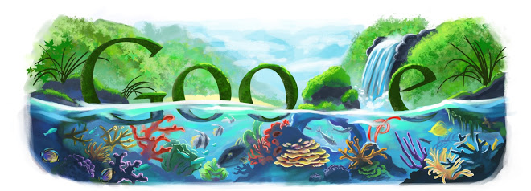

# Hello World

The time-honored tradition of always starting a new programming challenge with 'Hello World'.

*The * Symbol Used This Way Lays Emphasis To A Given Word(s)*

Using Double Asteriks Before And After A Word(s) Makes It **Bold**

Using The Tilde Character Strikes Through A Word(s) ~Strikethrough~

# My Routine

* Wake Up At 8AM
* Take A Shower
* Breakfast
  * Prepare The Food
  * Eat
  * Wash Dishes
  
# To-Do Tasks

1. Head To Class.
1. Meet A Friend.
1. Head Back Home.
1. Make Supper.

Head Over To [Google.](http://www.google.com "Google")

Another Approach Would Be To Just Paste The Url Like So -> https://www.google.com

A Fun Google Logo Image:

Here's A Fun Google Search Page:

